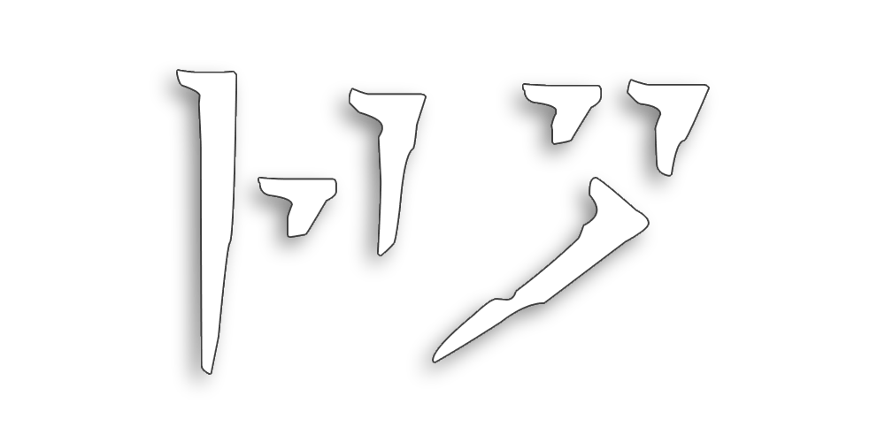

# Ro - A Balanced Modlist

## Simple, Stable(?), Sensible, Sexy

### [Changelog](https://github.com/ThirdEyeSqueegee/Ro/blob/main/CHANGELOG.md) | [Discord](https://discord.gg/7PRfhRdedF) | [First-Time Setup](https://github.com/ThirdEyeSqueegee/Ro/blob/main/SETUP.md) [Nexus page](https://www.nexusmods.com/skyrimspecialedition/mods/84408)

 

Less is more. More is also more. Requires Anniversary Edition.

NOTE: This is a **beta release**. As such, bugs and issues are to be expected and will be dealt with swiftly and with great prejudice. Please report any issues/bugs and help me make this modlist even more amazing than it already is!

Ro is an attempt to bring together the latest and greatest graphics mods and focused, true-to-vanilla gameplay overhauls including the full SimonRim suite. It's intended to look good and feel good without straying too far from the game we all know and love. Ro features extensive rebalancing, redistribution, and reduced cuts to make Anniversary Edition feel less clunky, the best graphical overhauls including Lux (+ Via and Orbis), Skyland AIO, tons of beautiful new complex parallax textures, and Rudy's ENB for Cathedral Weathers. All this with great performance—tuned out of the box to run smoothly with minimal frame drops. Made with modding in mind: for those of you that want to build on top of this list, I tried to minimize the time it takes to regenerate LODs etc. To this end, there are no mods in this list that add new worldspaces.

Find the full modlist over on [LoadOrderLibrary](https://loadorderlibrary.com/lists/ro-a-balanced-modlist-beta) if you'd like a closer look. Join the [Discord server](https://discord.gg/7PRfhRdedF) for questions, bug reports, mod suggestions, or just to come hang out!

### Technical notes:

- Installation size: ~100 GB
- PC requirements: Probably something that was built within the last four years using parts that were released within the last four years.

### Highlights:  

UI:

- CoMAP
- Untarnished UI
- Compass Navigation Overhaul
- Completionist

Graphics:

- Skyland AIO
- Underground + parallax
- QW's Grass Patch 2 + complex grass
- Lux + Via and Orbis
- EVLaS
- Embers XD
- Rudy's ENB for Cathedral Weathers
- ENB lights for damn near everything that glows (even some things that don't)

Locations:

- Capitals and Towns of Skyrim
- Spaghetti's Cities
- Unmarked Locations Pack

Gameplay, Physics, and Animations:

- Precision
- EVG Conditional Idles + Animation Variance
- SimonRim (+ complimentary mods)

Followers:

- Inigo
- Lucien

Improved Questlines:

- All of jayserpa's stuff

CC Content:

- Tamrielic Distribution
- Bow of Shadows, Ghosts of the Tribunal, etc. Reduced Cuts

Audio:

- Memospore - UI Sound Effects
- Deadeye
- Phoenix Compendium
- Chapter II (Jeremy Soule Inspired Music)
- The Northerner Diaries (by Jeremy Soule)

Dialogue:

- Guard Dialogue Overhaul
- Forsworn, Thalmor, Bandit, Carriage etc. dialogue expansions
- Serana Dialogue Edit (yes, Edit, not Add-On)

World Map:

- A Clear Map of Skyrim

This description is a work in progress.
