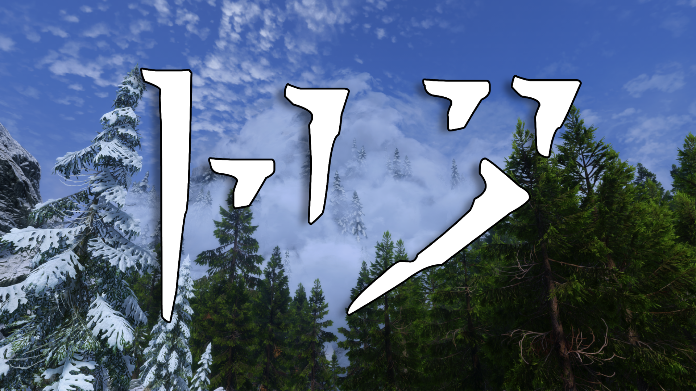

# Ro - A Graphics-Focused Modlist

## "And the Scrolls have foretold, of black wings in the cold..."

### [Changelog](/CHANGELOG.md) | [Discord](https://discord.gg/WF66mMu) | [Installation](/INSTALLATION.md) | [First-Time Setup](/SETUP.md) | [Nexus page](https://www.nexusmods.com/skyrimspecialedition/mods/84408) | [LoadOrderLibrary](https://loadorderlibrary.com/lists/ro-a-graphics-focused-modlist)

 

Less is more. More is also more. Requires Anniversary Edition + Creation Club content.

Do you hate your PC? Do you want to see your CPU melt? Do you want to _truly_ benchmark your build? These are all rhetorical questions.

**Q**: "Why Ro and not {some modlist}?"  
**A**: Ro is focused on providing the best possible visual experience for Skyrim coupled with sensible gameplay overhauls that work together to make Ro a pleasure to look at and play.

Ro is an attempt to bring together the latest and greatest graphics mods and focused, true-to-vanilla gameplay overhauls including the full SimonRim suite. It's intended to look good and feel good without straying too far from the game we all know and love. Ro features extensive rebalancing, redistribution, and reduced cuts to make Anniversary Edition feel less clunky, the best graphical overhauls including Lux (+ Via and Orbis), Skyland AIO, **full widescreen/ultrawide and controller support**, tons of beautiful new complex parallax textures, and Rudy's ENB for NAT.

Find the full modlist over on [LoadOrderLibrary](https://loadorderlibrary.com/lists/ro-a-graphics-focused-modlist) if you'd like to take a closer look at what's included. Join the [Lost Outpost Discord server](https://discord.gg/WF66mMu) for questions, bug reports, mod suggestions, or just to come hang out!

**Please refer to [this](/KEYBINDS.md) for some useful default keybinds.**

**[Frequently Asked Questions](/FAQ.md)**

### Technical notes:

- Installation size: ~225 GB
- PC requirements: This list is heavy on VRAM&mdash;a GPU with &ge;12 GB of VRAM is recommended
- My specs for reference: Ryzen 5950X + RX 6900 XT + 32 GB 3600CL16 RAM

### Showcase videos:

- biggie_boss Livestream [Part 1](https://www.youtube.com/watch?v=UzZu9CWvkFI), [Part 2](https://www.youtube.com/watch?v=zmUaxoftm3g)

Note: The following videos showcase older versions of the list, which may not accurately reflect the current state of the list

- [biggie_boss &ndash; YouTube](https://www.youtube.com/watch?v=loFsLilC1UY)
- [Digital Dreams &ndash; YouTube](https://www.youtube.com/watch?v=5OabYOmb05I)
- [Deep Voice Gamer &ndash; YouTube](https://www.youtube.com/watch?v=PgYoI4yKRr8)
